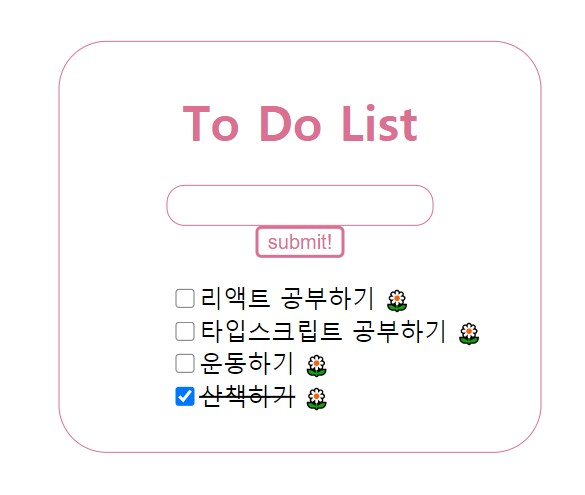

## To do list App📜

### Tech Stack

TypeScript 
React 
Redux 
styled-components

### Feature

- 인풋에 할 일 입력하여 상태 관리
- 할일 리스트 상태관리하여 보여지기 (리덕스 사용)
- 체크박스로 완료여부 체크하기 (리덕스 사용)
- 삭제버튼 클릭시 할일 없어지기 (리덕스 사용)
